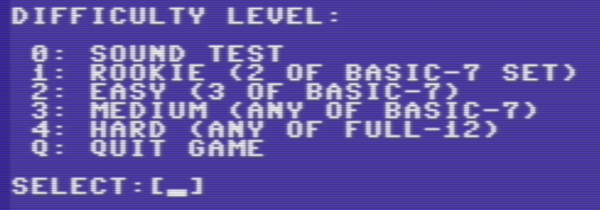
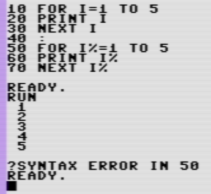

# Intervallo - What I learned from developing a simple game in Basic, after 35 years

 <div class="copr">
 by ern0, 2023.02.21 - repository: [intervallo](https://github.com/ern0/intervallo)
 </div>

## Introduction


### The motivation

The Hungarian Commodore Plus/4 FB-group
has announced a competition for
creating games
in three categories:
BASIC, mixed and pure machine code.
I was already planning to
make something
for my
[*home platform*](https://plus4world.powweb.com/members/ern0),
so I thought I'd enter.

I knew I wouldn't have enough time
to make a complete game
with graphics, music etc.,
so I wanted something simple.

I started programming - in BASIC -
at the age of 13,
and two years later,
when I got my first computer,
a Commodore 16,
I wrote some games for it,
first in BASIC.

Later I switched to
Assembly programming,
made two music editors,
and created
some songs with them,
which made me kinda' famous
in the early C16/Plus4 scene.

It has been *35 years* since
my last BASIC game.

**What if I wrote the game in BASIC
for the competition? After 35 years?**

Of course,
the project smells of nostalgia,
it would be a lie to deny it.
*Time travel to my teenage years*,
no doubt.

But there will be lessons learned.
Decades have passed since then,
which -
in this profession,
where a new era comes every
few years -
is a very, very long time.
Hardware,
programming and languages,
software development methodologies
have all undergone
revolutionary changes.

I've changed too,
from an enthusiastic autodidact gifted amateur kid to an
enthusiastic autodidact only-slightly-worse-than-average
professional software developer.

Adding the two together is
certainly not without lessons.


### Game idea

Let's specify requirements:

- The game should be written in pure BASIC,
  so it can be easily ported to other machines.
	Commodore BASIC V2.0 seems a good choice,
	it's quite simple and standard, and
	also Commodore 64 is an obvious alternative target.
- The game should not rely on
  machine-specific features,
	should not contain graphics,
	just a plain console.
- The game should not require large assets,
  e.g. levels, graphics, game logic, texts...
  simply, I have no time for creating
  too much content.

Great, but then what kind of game? A music game.
Without precise timing and gaphics?
I know one: **interval guess game** -
not too original idea,
but it is music related,
has educational value,
and even possible that
someone will play with it.

Now we need a good title.
Both music and Plus/4 scene
is linked to Italy,
an Italian title would be appropiate.

> **Me**: *Bro, pls help me translating something.
Despite that the lingua of the music is Italian,
and I know some terms,
like piano, forte, parlando etc.,
I don't know the name of "pitch distance".
Probably, it's "intervallo",
but maybe this is not a proper translation.*
>
> **Luca:** *Yes, it's the intervallo.
And the pitch is Altezza.*

Obviously, one item had to added
to the requirement list:

- the computer should be able to
  play an interval somehow.


### Game design

First of all, I wrote the design document,
in which I specified the platform, 
the gameplay,
and the development method.
It was pretty good plan,
only a few things are changed
during the implementation.

You can check
[the design document](design.md).

The **platform** was a given,
I stuck to the text 40x24 text mode.
The only extra is, that
the good and bad answers are indicated
by a short green or red flashing of the
border color.

The **gameplay** was cleaned up during development,
defined difficulty levels (even a hidden one),
handling of bad answer, scoring etc.
Also added extra sound test function.

The **development** tools were given,
I was using my favourite text editor,
*petcat* and *VICE*,
I have had only one difficulty:
text editors do not support line numbering.


### No onboard development

I'm not afraid of difficulties.
I never had a floppy drive
for my Commodore 16,
I was using tape.
For a long time
I only had B/W TV set,
at least, it had good sound.

So I'm not a snowflake.

But it was not an option to
develop on-board. Nor on emulator.
Modern text-editor,
frequent quick save
and version control
would heve been really missing.


## Lessons Learnt

*Below is a list of the experiences
I have had during the development.
They are listed in random order.*


### The renumber problem

Writing a BASIC program requires 
that you write line numbers.
But we don't write the programs
to start at the first line and 
end at the last.
So there comes a point
when we have to renumber the lines,
to make room for inserting new ones.

Of course, there's no text editor
with renumber functionality
or other support of BASIC.
So, I had to write a 
*Renumber Tool* - you can find it
in the repository: `renumber.py`.

As turned out, 
there are serious disadvantages
using line numbers:

- It's totally messing up version control,
  if you just insert one line,
  then renumber,
  lot of lines will "change".
- In certain cases, the Renumber Tool
  could not figure out the situation,
  and silently fails, creating bad references.
  It can lead to mystic runtime errors.

Using the renumber tool
the development was more comfortable
than without it.
But it was not really comfortable.


### Line numbers vs labels

Writing the Renumber Tool,
I had enough time to think about it:
do we really need line numbers?
The purpose of line numbers is
*line addressibility*,
we can reference a specific line
with its unique line number.
This requirement, that
lines should be referenced individually,
became obsolete
with the introduction of
structured programming.
Nevertheless, it was never a real requirement
that *every* line should be referenced.

The question is:
then what is the exact role of 
having line numbers for *each* line?

The answer is:
line numbers not only can be used as labels,
but line numbering is the BASIC's *editor concept*.

It's relatively convenient to write
BASIC programs in a puritan environment,
without full-screen editor,
setting the order of lines,
or deleting them,
by using line numbers.

On C64, without `RENUMBER` command,
you can find yourself quickly in the situation
that you can't insert more lines
because of line numbers.
That's embarrasing, and can be solved only
by some tiresome handwork.

Labels are better, but
that requires another editor concept,
e.g. MUMPS. 
If you ask me, labels are far better than line numbers.

Yes, instead of writing `renumber.py`,
I should have been written
some kind of label-to-numbers thing,
but it would be not BASIC programming anymore.


### The lost focus

In recent years,
in software development,
we have lost the *focus*.
Software development is now an industry:
a lot of administration, 
processes, 
quality assurance etc.,
and in the meantime 
we forget that we should be 
writing the program.

With these old systems,
like dBase/FoxPro, BASIC, MUMPS etc.
the programmer can focus on the actual job,
and can be extremly effective.

This is not trivial nowadays,
a software project is not always successful,
and it is very rarely finished on time.

When I was writing this game,
I was reliving that oldschool, 
no fluff experience.
The part was given that I knew
what I wanted to do,
and also BASIC is a good partner in
this kind of staight, 
focused development.


### BASIC is dense

The whole program is **266 LOC**, including
some data (note frequencies, intervals).
This is what interpreted languages are for:
write medium complex things
in some dozens of lines.

How many lines does it take to display a menu?
As many menu items we have,
plus one for the header and
one for the blank lines.

```
1201 print "difficulty level:"
1202 print
1203 print " 0: sound test"
1204 print " 1: rookie (2 of basic-7 set)"
1205 print " 2: easy (3 of basic-7)"
1206 print " 3: medium (any of basic-7)"
1207 print " 4: hard (any of full-12)"
1208 print " q: quit game"
1209 print
```
How many lines does it take to
ask the input from the user?
One, which prints the question,
and asks the input from the user.
```
1211 input "select"; k$
```
Okay, `INPUT` is lame, the actual code is
calling a custom keyboard reader subroutine:
```
1211 k$="select" :kk$="012345q" :gosub 8800
```
It's still one line. And the result is:



BASIC programs are short,
and focusing only the thing they are doing.
Sounds silly, I'm trying to rephrase it to make sense:
no rituals, no meta stuff, no ceremonies.

For example, there're no bloated GUIs.


### Terminal apps forever

A program that can only be used with a mouse
is a usability disaster.

At the corner bakery,
where customers need to be served quickly,
especially in the morning rush,
the cashier program is character-based.
If an item needs to be corrected,
the cashier presses a few buttons and it's done.
Selecting a payment method is
also a matter of two keystrokes.
An inexperienced user,
like an average clerk,
with a mouse would, well, die.

A good text-based UI is clear,
the user always knows
what options are available.
You don't have to guess
which icon the menu is hidden behind,
where to tap to do certain thing
(icons are evil, flat UI rules! my ass.),
how to go back,
just look at 
what the last line on the display says.
If you learn the keystrokes
for each situation,
you can move on pretty quickly.

Of course,
not every genre is suited to a character-based UI,
but where the workflow follows a strict path and
each state has only few, simple choices,
it's ideal.

I hope I managed to create a good UI.
The only difficulty is that
you can't use numbers
to get the answer during the game.
For one thing,
there would be no clear solution to the
the problem of assigning 
interval to which number.
On the other hand, there are
although rarely at the same time
more than ten intervals in the game.
So I decided to use letters,
without holes, always rearranged
according to the actual interval.

I've created a custom input routine,
with a custom blinking cursor
which first displays the pressed key
for a short time,
then replaces it with the word it means.

A nice full screen GUI would be better,
but the goal was
was to make porting to other platforms
as easy as possible.


### BASIC is flat

Before structured programming, 
a language had a fixed number of instructions.
Today, if you do not have something like `LEFT$()` function, 
you simply implement it from scratch, or by using 
similar functions, say, `MID$()`.

You cannot define new functions in BASIC
(only sigle-line ones with `DEF FN`.)

Right, you can write subroutines, 
but it's inconvenient:
a subroutine has no name, 
no parameters, 
no local variables, 
no return value, 
you have to solve everything yourself 
using global variables. 

So, you can only use 
the actual instruction set.
If your BASIC version supports 
cursor positioning, you can use it, 
if not, you can't.
No libs, no frameworks,
no 3rd party anything.
No 
[call graph](https://en.wikipedia.org/wiki/Call_graph).
You have to create the only one layer:
the business logic.
You write the program in one go.


### BASIC is EUP

The BASIC, 
shipped with the computer, in its ROM,
is the most common development environment
for the given machine,
100% of the users has it.

> *"For a long, long time, if you were interested in computers at all, you programmed in BASIC. It was as unavoidable and inevitable as the air you breathed. Every time you booted up, there was that command prompt blinking away at you. Why not type in some BASIC commands and see what happens? And then the sense of wonder, of possibility, of being able to unlock the infinitely malleable universe inside your computer. Thus the careers of millions of programmers were launched."*
>
<div style="text-align: right;">
*([Coding Horror](https://blog.codinghorror.com/everything-i-needed-to-know-about-programming-i-learned-from-basic/))*
</div>

BASIC is easy to learn,
even ones without software developer experience
can understand a short BASIC program,
or can write their own after some practicing.

Actually, 
BASIC is *designed* to be easy to learn.
If you are familiar with
variables, numeric and string types,
INPUT and PRINT instruction,
concept of line numbers and GOTO, 
IF/THEN and FOR/NEXT,
you can create your own application.

If you wanted to solve 
something with the computer, 
you wrote your own BASIC program, 
or at most you invited the 
computer guy next door to help you.

BASIC programs were published in newspapers,
or even on 
[vinly cover](https://hungame.blog/2017/04/10/rozsak-valerianak-kft-egyuttes/).

End-user programming, at its best.


### Commodore BASIC: no integer as loop variable

The average BASIC programmer doesn't care much about types, 
plus writing integer postfix for every variable is inconvenient.
So after 35 years, it came as a surprise that 
the `FOR/NEXT` instruction pair does not accept integers.



Syntax error! I think, it's a design flaw.


### Commodore BASIC: variable name restrictions

The BASIC interpreter uses only the first two letters 
for difference between variebles,
so `VAR1` and `VAR2` are the same.

Also, reserved words should not be used in variable names.
Reserved words are all the instruction names, e.g. `IF`, and
some system variables, like `TI` or `ST`.
For example, `START` and `DIFF` are invalid variable names.

Even if you're very careful, you'll just run into one,
so did I, of course.


### Bottom line

